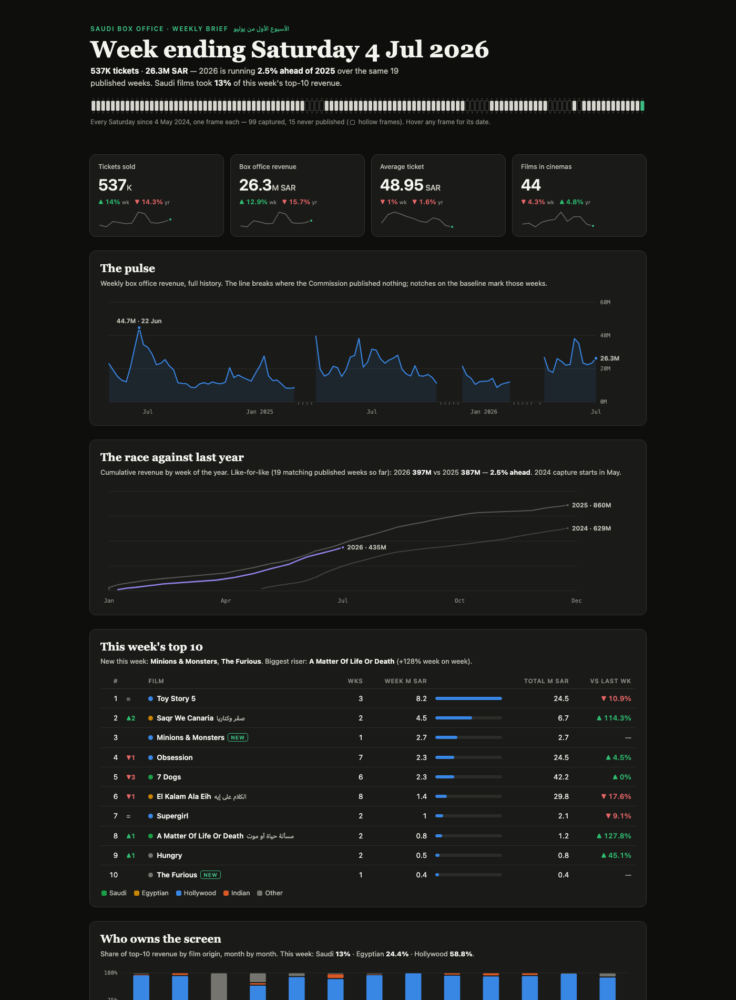

# Filmmaking Skills

Film & TV production tools and datasets for [Claude Code](https://claude.com/claude-code),
shared by Mo. Practical things that help with real production work, starting with a
weekly Saudi box office dataset and growing from there.

---

## Saudi Box Office Tracker

A clean, growing dataset of the Saudi cinema box office, rebuilt every week from the
Saudi Film Commission's public reports. Headline numbers plus a top-10 films panel,
turned into structured data you can track, compare, and chart over time.

- **99 weeks** captured so far (4 May 2024 to 4 July 2026)
- **~291 unique films** across ~990 entries
- Delivered as an Excel workbook, a JSON source-of-truth, and an offline dashboard

**➡️ [Open the tracker](saudi-box-office-tracker/)** for the full data, the dashboard,
and how it's built.



---

## Skills (coming soon)

A **skill** is a folder of instructions that teaches Claude Code how to do a specific
job well. Drop one into your setup and Claude picks it up automatically when the topic
comes up. Production skills will be published here one by one.

Watch this repo (the **Watch** button above) to get notified when they land.

### Installing a skill (once published)

1. Install [Claude Code](https://claude.com/claude-code).
2. Copy the skill folder you want into `~/.claude/skills/`:

   ```bash
   git clone https://github.com/mohilaly/filmmaking-skills.git
   cp -R filmmaking-skills/<skill-name> ~/.claude/skills/
   ```

3. Start Claude Code and just trigger the skill.
